# AI

## 基础AI对话平台

### Cherry Studio

> 官方文档：[点击访问](https://docs.cherry-ai.com/)

### OpenWebUI

#### 安装Docker

##### 下载Docker

前往[Docker](https://docs.docker.com/desktop/install/windows-install/)下载安装包
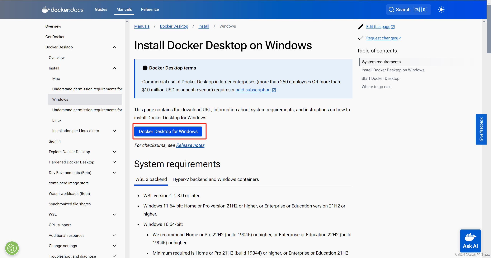

##### 启动微软Hyper-V与WSL

- 打开“控制面板->程序->启用或关闭Windows功能”
  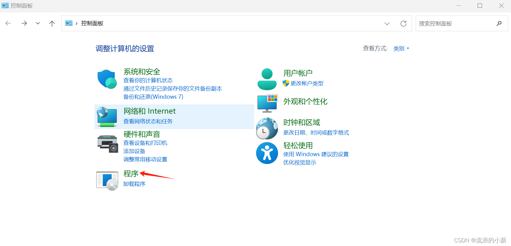
  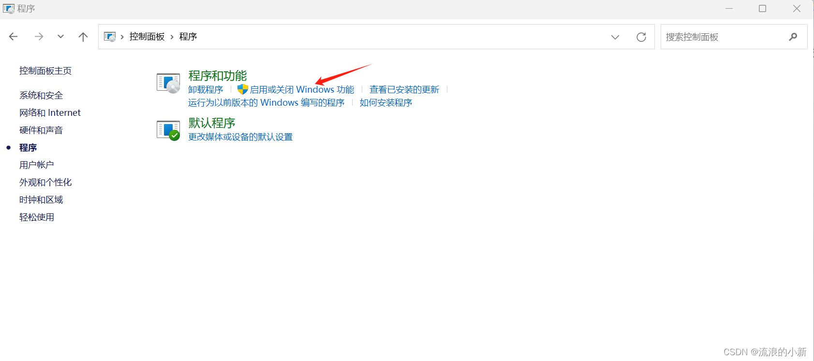
- 勾选Hyper-V选项
  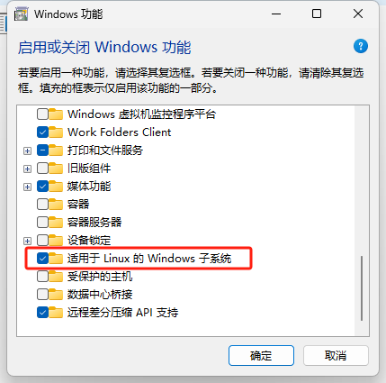
- 重启电脑后安装成功

> 若没有Hyper-V选项，可以使用如下命令安装：

```cmd
pushd "%~dp0"

dir /b %SystemRoot%\servicing\Packages\*Hyper-V*.mum >hv.txt

for /f %%i in ('findstr /i . hv.txt 2^>nul') do dism /online /norestart /add-package:"%SystemRoot%\servicing\Packages\%%i"

del hv.txt

Dism /online /enable-feature /featurename:Microsoft-Hyper-V -All /LimitAccess /ALL

Pause
```

##### 安装Docker


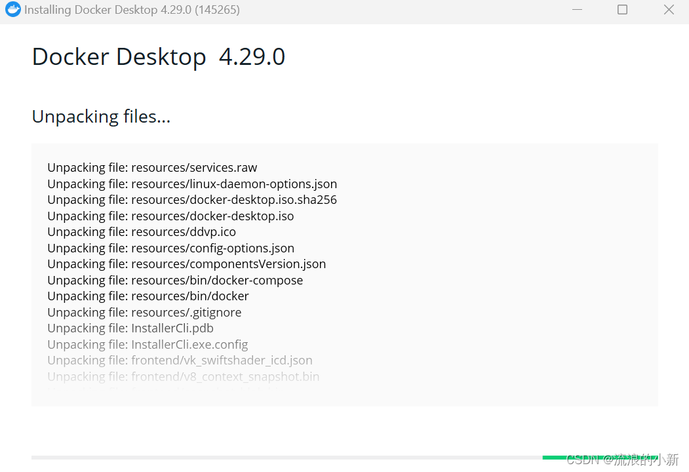
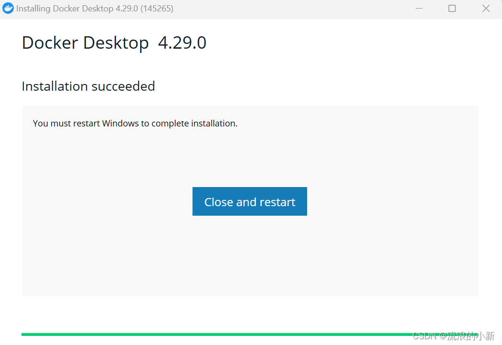

打开之后是这个样子，一般不需要使用，用命令行操作即可。
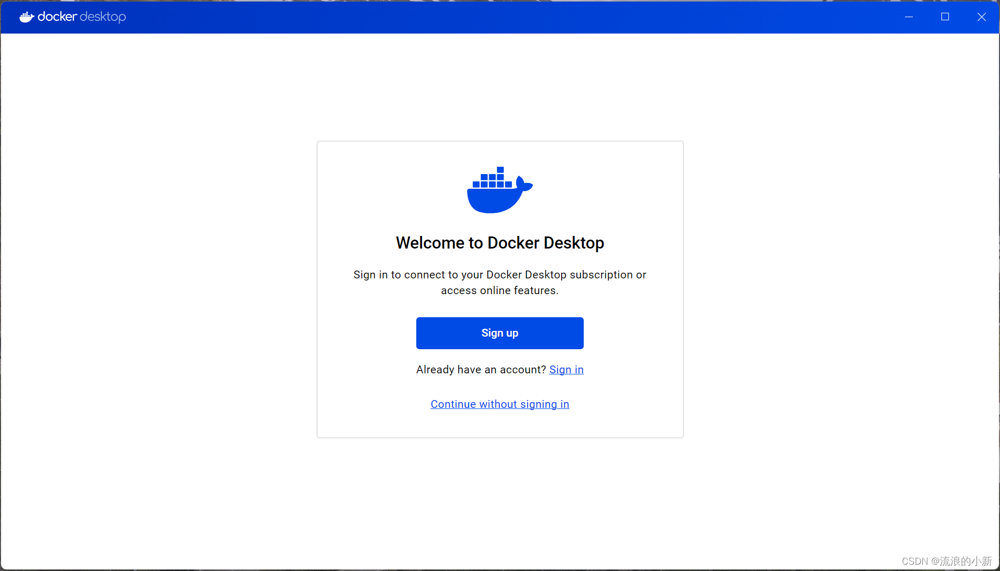
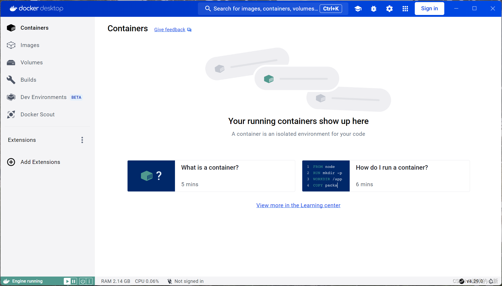

在CMD中输入docker -v验证安装


##### 切换国内镜像源

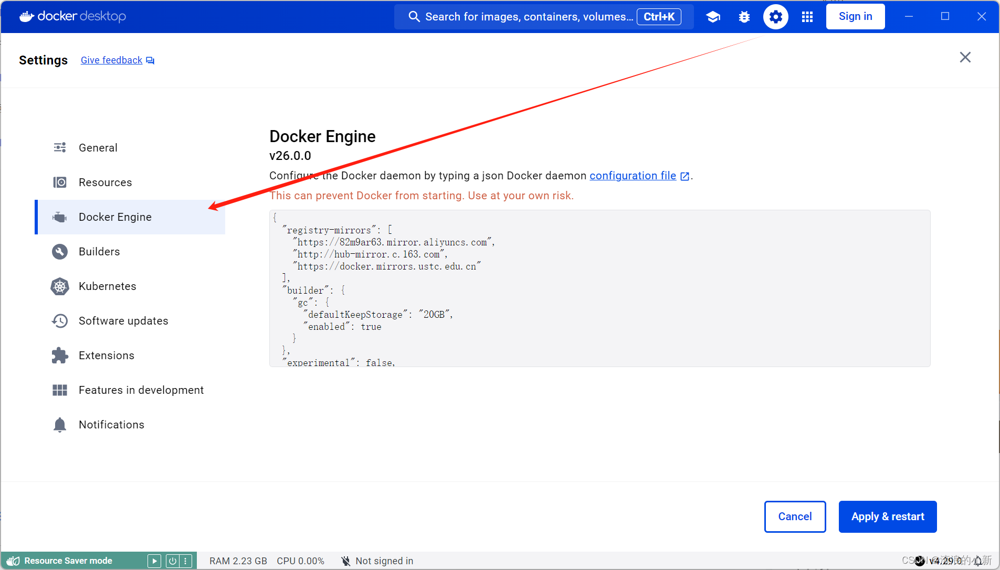

```json
{
  "registry-mirrors": [
    "https://82m9ar63.mirror.aliyuncs.com",
    "http://hub-mirror.c.163.com",
    "https://docker.mirrors.ustc.edu.cn"
  ],
  "builder": {
    "gc": {
      "defaultKeepStorage": "20GB",
      "enabled": true
    }
  },
  "experimental": false,
  "features": {
    "buildkit": true
  }
}
```

##### 安装OpenWebUI

开源[GitHub](https://github.com/open-webui/open-webui)，在命令行输入```docker run -d -p 3000:8080 --add-host=host.docker.internal:host-gateway -v open-webui:/app/backend/data --name open-webui --restart always ghcr.io/open-webui/open-webui:main```
!(../vibe-coding/assets/2c7d4a75da1a4ed9ae1f2ed4da42ca65.png)
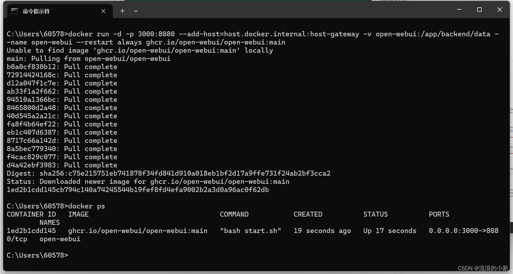

> [!NOTE]
>
> 注册时邮箱可以随便填写，例如：admin@111.com

##### web访问llama3

注册登录后可以看到直接可以选择之前部署好的llama3:8b模型，通过对话测试下它的能力。
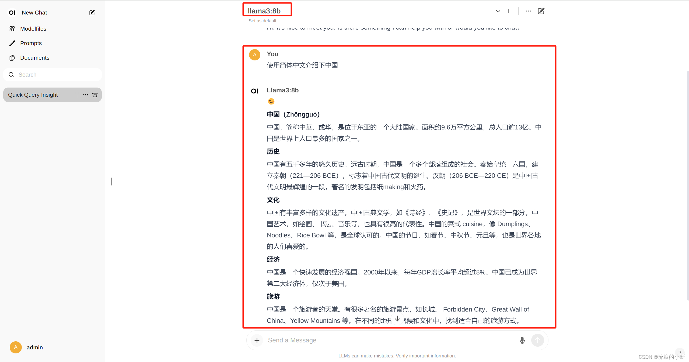

> [!NOTE]
>
> 后台一定要运行着模型，`ollama run llama3:8b`

### Ollama部署本地大模型

#### 电脑配置

| 最低配置： |                |
| ---------- | -------------- |
| 操作系统   | Windows 10以上 |

| 推荐配置： |            |
| ---------- | ---------- |
| 显卡       | >=1050-4GB |
| CPU        | >=i5第八代 |

#### 安装Ollama

##### 下载Ollama

登录[Ollama官网](https://ollama.com/)下载Ollama安装包，推荐前往[GitHub](https://github.com/ollama/ollama?tab=readme-ov-file)用[GitHub文件加速](https://github.akams.cn/)
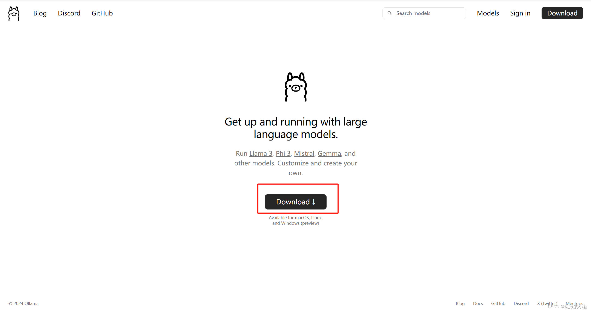
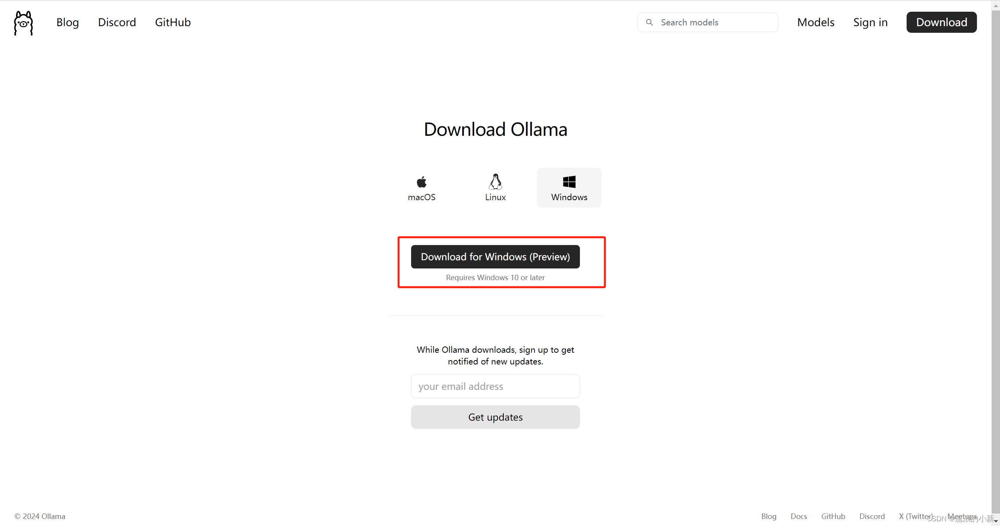

##### 安装Ollama

Windows下安装Ollama很简单，双击运行安装文件即可，此处不赘述。
打开终端，输入`ollama`，出现下图所示代表安装成功
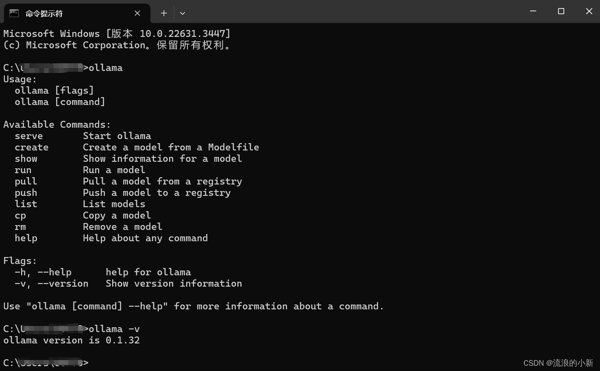

> [!NOTE]
>
> 1. windows 的安装默认不支持修改程序安装目录，
> 2. 默认安装后的目录：C:\Users\username\AppData\Local\Programs\Ollama
> 3. 默认安装的模型目录：C:\Users\username\ .ollama
> 4. 默认的配置文件目录：C:\Users\username\AppData\Local\Ollama

##### 配置Ollama的模型路径

由于Ollama的模型默认会在C盘用户下的.ollama/models文件夹中，可以配置环境变量OLLAMA_MODELS，设置为指定的路径：


##### 下载模型

以llama3为例子，llama3目前主要有8B和70B两个模型，分别代表80亿和700亿个训练参数。
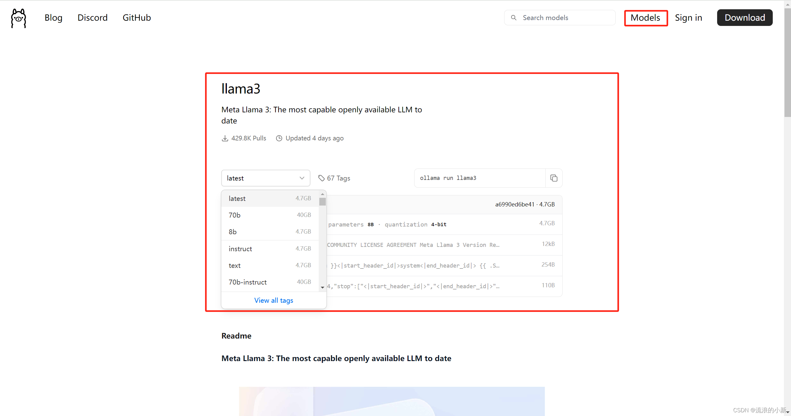
打开终端，输入命令：`ollama run llama3`默认安装8B模型，也可以使用`ollama run llama3:8b`来指定相应的模型，安装成功会有如下提示：


> [!NOTE]
>
> 1. 在没有互联网的环境下部署，可以将下载好的Ollama安装包复制到此环境安装，然后将下载好的模型复制到相应路径就可以在无互联网的环境下使用。
> 2. 由于llama3对中文的支持并不是很好，需要中文的可以使用GitHub上开源的这个llama3中文微调模型https://github.com/LlamaFamily/Llama-Chinese


#### 补充
##### 1  离线部署
###### 1.1 将在线下载的docker images保存
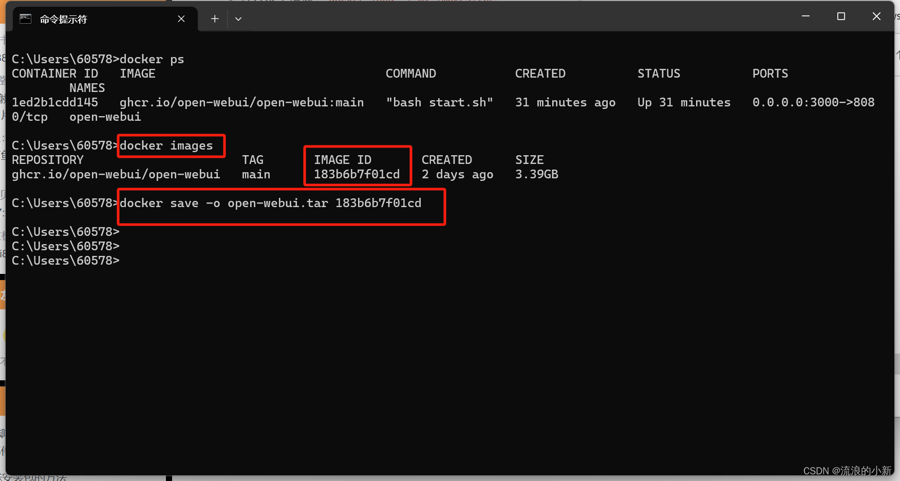
###### 1.2 在离线的机器上装载该镜像
   `docker load -i open-webui.tar`
###### 1.3 使用3.2章节的命令启动容器即可

##### 2 ollama常用系统参数设置

1. **`OLLAMA_MODELS`**：模型文件存放目录，默认目录为当前用户目录（Windows 目录：`C:\Users%username%.ollama\models`，MacOS 目录：`~/.ollama/models`，Linux 目录：`/usr/share/ollama/.ollama/models`），如果是 Windows 系统**建议修改**（如：D:\OllamaModels），避免 C 盘空间吃紧
2. **`OLLAMA_HOST`**：Ollama 服务监听的网络地址，默认为**127.0.0.1**，如果允许其他电脑访问 Ollama（如：局域网中的其他电脑），**建议设置**成**0.0.0.0**，从而允许其他网络访问
3. **`OLLAMA_PORT`**：Ollama 服务监听的默认端口，默认为**11434**，如果端口有冲突，可以修改设置成其他端口（如：**8080**等）
4. **`OLLAMA_ORIGINS`**：HTTP 客户端请求来源，半角逗号分隔列表，若本地使用无严格要求，可以设置成星号，代表不受限制
5. **`OLLAMA_KEEP_ALIVE`**：大模型加载到内存中后的存活时间，默认为**5m**即 5 分钟（如：纯数字如 300 代表 300 秒，0 代表处理请求响应后立即卸载模型，任何负数则表示一直存活）；我们可设置成**24h**，即模型在内存中保持 24 小时，提高访问速度
6. **`OLLAMA_NUM_PARALLEL`**：请求处理并发数量，默认为**1**，即单并发串行处理请求，可根据实际情况进行调整
7. **`OLLAMA_MAX_QUEUE`**：请求队列长度，默认值为**512**，可以根据情况设置，超过队列长度请求被抛弃
8. **`OLLAMA_DEBUG`**：输出 Debug 日志标识，应用研发阶段可以设置成**1**，即输出详细日志信息，便于排查问题
9. **`OLLAMA_MAX_LOADED_MODELS`**：最多同时加载到内存中模型的数量，默认为**1**，即只能有 1 个模型在内存中


##### 3.ollama常用命令

1. 展示本地大模型列表：`ollama list`
2. 删除单个本地大模型：`ollama rm 本地模型名称`
3. 启动本地模型：`ollama run 本地模型名`
4. 查看本地运行中模型列表：`ollama ps`
5. 复制本地大模型：`ollama cp 本地存在的模型名 新复制模型名`
6. 下载或者更新本地大模型：`ollama pull 本地/远程仓库模型名称`
7. 下载且运行本地大模型：`ollama run 本地/远程仓库模型名称`
8. `/clear`清除对话上下文信息
9. `/bye`则退出对话窗口
10. `/set parameter num_ctx 4096`可设置窗口大小为 4096 个 Token，也可以通过请求设置，如：`curl <http://localhost:11434/api/generate> -d '{ "model": "qwen2:7b", "prompt": "Why is the sky blue?", "options": { "num_ctx": 4096 }}'`
11. `/show info`可以查看当前模型详情：

##### 4 将GGUF大模型导入ollama

###### 4.1 下载GGUF大模型

前往[HF镜像站](https://hf-mirror.com/)或者[魔塔](https://www.modelscope.cn/)下载所需要的大模型

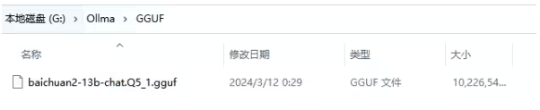

###### 4.2 新建对应的.mf文件

我这个是baichuan2-13B，就新建个baichuan2-13B.mf，文件内写`FROM ./baichuan2-13b-chat.Q5_1.gguf`

###### 4.3 对大模型新建引导

打开CMD，跳转到对应文件夹`cd G:/Ollama/GGUF`，新建引导`ollama create baichuan2:13b -f baichuan2.mf`

##### 5 导入 safetensors 模型文件

未实践，贴两个地址 [官方文档](https://ollama.fan/getting-started/import/#importing-pytorch-safetensors)或[Ollama完整教程：本地LLM管理、WebUI对话、Python/Java客户端API应用 - 老牛啊 - 博客园](https://www.cnblogs.com/obullxl/p/18295202/NTopic2024071001)


## AI生成PPT

[点击访问GitHub](https://github.com/GeekyWizKid/prompt-lesson)，[点击访问原帖](https://linux.do/t/topic/767490)

### 本地运行

```bash
# 克隆项目
git clone https://github.com/sligter/LandPPT.git
cd LandPPT

# 安装依赖（推荐uv）
uv sync
uv pip install apryse-sdk --extra-index-url=https://pypi.apryse.com

# 配置环境变量
cp .env.example .env

# 启动服务
uv run run.py
```

### Docker 部署

```bash
# 拉取镜像
docker pull bradleylzh/landppt:latest

# 启动容器
docker run -d \
  --name landppt \
  -p 8000:8000 \
  -v $(pwd)/.env:/app/.env \
  bradleylzh/landppt:latest
```


