# ZCF-Zero-Config Code Flow

## 💻 安装指南

### 步骤 1：启动安装程序

在你的终端里输入下面的命令，然后按下回车键：

```bash
npx zcf
```
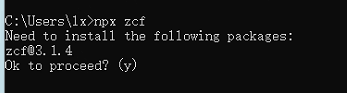
### 步骤 2：确认并选择语言

*   程序会询问你是否继续，输入 `y` 并回车。
*   接着选择语言，输入 `1` 选择中文。
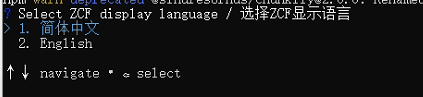
### 步骤 3：选择安装方式

*   **全新安装**：输入 `1` 开始全新安装。
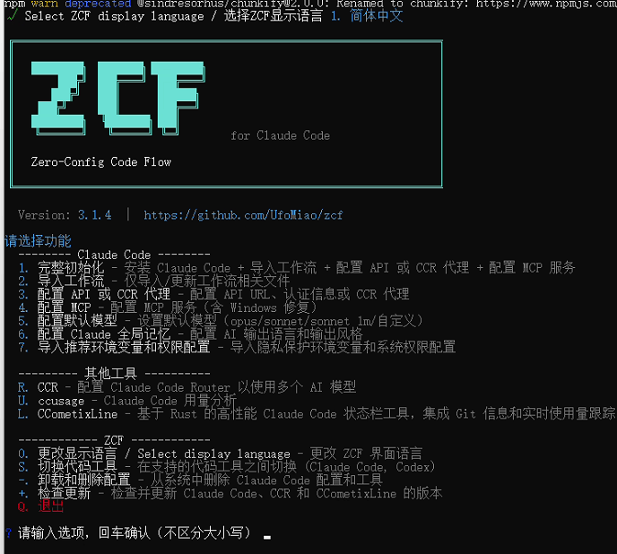
*   **跟着流程一步步配置**：

*   **是否需要更新ClaudeCode**： 需要输入`y`，不需要输入`n`
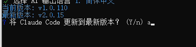
### 步骤 4：配置 AI 模型（以智谱 GLM 为例）

1.  在配置选项中，用方向键 ↓ 选择 `自定义API配置`。
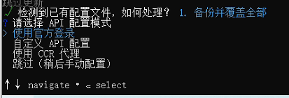
2.  在模式选择中，选择 `KEY模式`。

3.  **API URL**：输入智谱的 API 地址：
    ```
    https://open.bigmodel.cn/api/anthropic
    ```

4.  **API Key**：输入你在智谱开放平台生成的密钥。
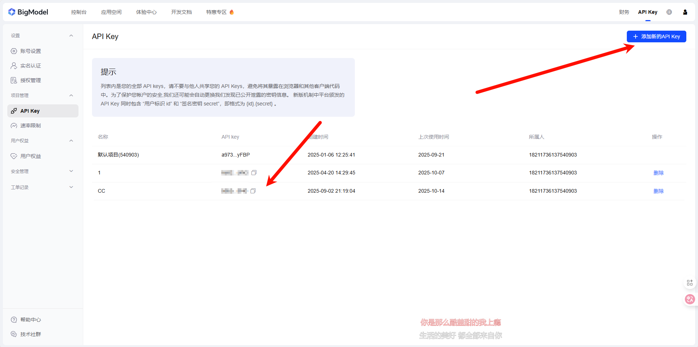
### 步骤 5：安装工作流与输出风格

1.  **安装工作流 (Workflows)**：根据提示选择。如果想全部安装，可以直接输入 `A` 然后回车。
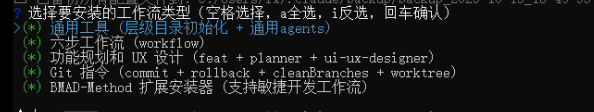
2.  **安装输出风格 (Output Styles)**：同样，如果想全部安装，输入 `A` 并回车。

3.  **选择默认输出风格**：从列表中选择一个你最喜欢的作为默认风格。
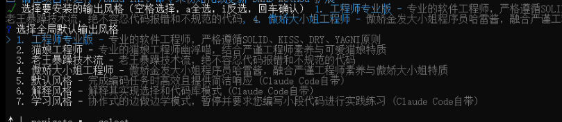
### 步骤 6：配置 MCP 服务与 CCometixLine

1.  **MCP 服务**：当询问是否配置时，输入 `y`。然后根据提示选择你需要的服务（我是选择 `1,3,4,5` 这几个MCP）。

2.  **CCometixLine**：当询问是否安装CCometixLine，我选中是。
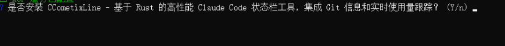
### 步骤 7：完成安装

*   耐心等待程序完成所有安装和收尾工作。
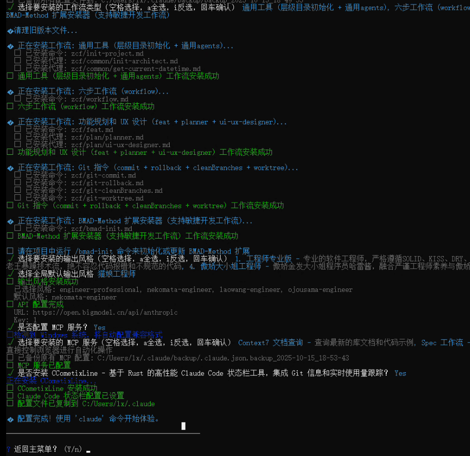
*   安装结束后，输入 `y`，然后输入 `q` 退出安装程序。
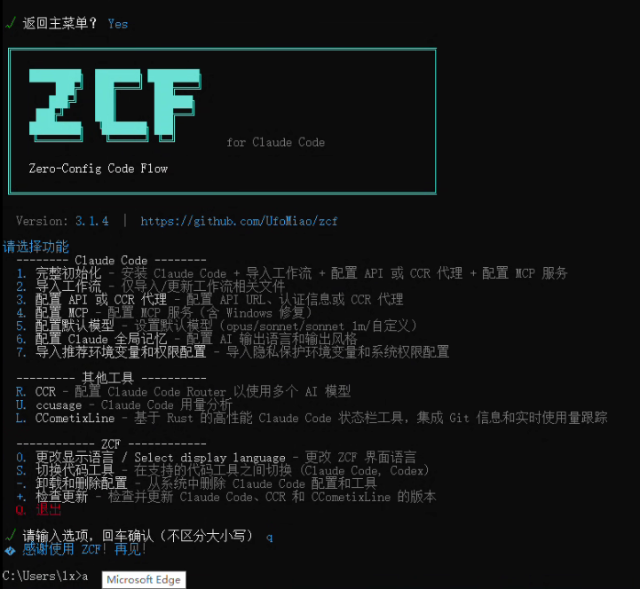
然后可以输入`claude`开始愉快的编码了

## 🚀 常用指令

### 项目与 Git

*   `/init-project`
    自动在项目各目录生成层级记忆文件 `CLAUDE.md`，帮助 AI 更好地理解你的项目。对于大型项目，可以多次执行来补充记忆哦。

*   `git-commit`, `git-rollback`, `git-cleanBranches`
    三个常用的 Git 智能指令，让版本控制更轻松。

*   `git-worktree` **【推荐】**
    worktree可以很方便的创建一个项目的工作区（副本），并且切换不同的分支，两个工作区互不干扰，并且使用的是一套git

    **使用方法**：
    ```bash
    # 基本操作
    /git-worktree add <path>                           # 从 main/master 创建名为 <path> 的新分支
    /git-worktree add <path> -b <branch>               # 创建指定名称的新分支
    /git-worktree add <path> -o                        # 创建并直接用 IDE 打开
    /git-worktree list                                 # 显示所有 worktree 状态
    /git-worktree remove <path>                        # 删除指定的 worktree
    /git-worktree prune                                # 清理无效 worktree 记录

    # 内容迁移
    /git-worktree migrate <target> --from <source>     # 迁移未提交内容
    /git-worktree migrate <target> --stash             # 迁移 stash 内容
    ```

### spec-workflow MCP 工作流

前面在ZCF安装后，可以这样使用：

```
使用spec开发：给项目增加xxx功能
```

## 📚 命令行参数参考

### 命令速查表

| 命令 | 缩写 | 说明 |
| :--- | :--- | :--- |
| `zcf` | - | 显示交互式菜单（默认） |
| `zcf init` | `zcf i` | 初始化 Claude Code 配置 |
| `zcf update` | `zcf u` | 更新 Prompt 文档并备份旧配置 |
| `zcf ccu` | - | 运行 Claude Code 用量分析工具 |
| `zcf ccr` | - | 打开 CCR (Claude Code Router) 管理菜单 |
| `zcf config-switch` | `zcf cs` | Codex API 提供商切换工具 |
| `zcf uninstall` | - | 交互式卸载配置和工具 |
| `zcf check-updates` | - | 检查并更新相关组件版本 |

### 常用选项与示例

```bash
# 首次安装，完整初始化
npx zcf init

# 更新 Prompt 文档，保留 API 和 MCP 配置
npx zcf update

# 强制使用中文配置重新初始化
npx zcf i -c zh-CN -f

# 运行用量分析工具
npx zcf ccu

# 切换 API 提供商
npx zcf cs
```
