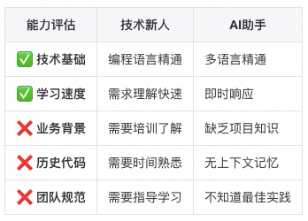
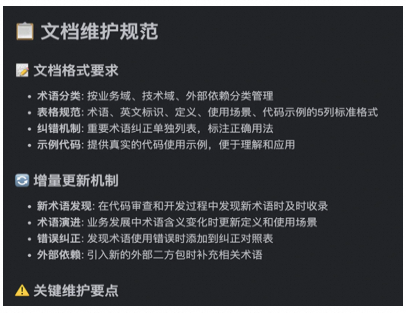

# Vibe Coding - 优秀文章&项目部分

## 优秀文章&项目

### 私域知识工程实战：如何让 AI 一次性写出高质量代码？

[点击访问原帖](https://linux.do/t/topic/991134)

> AI编程的瓶颈不在于模型不够聪明，而在于信息不对称。
>
> 通过简单、快速构建私域知识工程体系 ，让AI从 “临时工” 变成真正懂业务的 “老司机” 。

1. 那个让人又爱又恨的"80分困境"

作为一个在复杂业务系统中摸爬滚打的开发者，我相信你一定经历过这样的场景：

满怀期待地打开Claude Code，兴冲冲地描述需求： **“帮我写一个订单退款接口”** 。几秒钟后，AI开始生成一行又一行看起来不错的代码。你心想：“10倍工程师，就是这种感觉！”

但是，当你准备把代码集成到项目里时，现实狠狠地给了你一巴掌：

```markdown
**第1轮**：帮我写订单退款接口
**第2轮**：业务规则错了，VIP用户有特殊处理...
**第3轮**：异常处理不规范，要使用我们的ErrorEnum...
**第4轮**：退款计算公式不对...
**第5轮**：日志格式不符合团队规范...

**结果**：花费2小时"沟通调教"，最终只有两种结局：
- 勉强可用
- 彻底放弃，还不如自己重写
```

AI帮你完成了80%的基础工作，但剩下20%的精细调整反而比从零开始更耗时耗力。

1. AI就像个技术很强的新员工

**2.1 AI vs 新员工：一个有趣的对比**

想想看，如果你们团队来了个技术功底很扎实的新人，你会怎么做？

肯定是先给他培训啊！介绍业务背景、代码规范、项目架构，让他熟悉各种"潜规则"对不对？

但对AI呢？我们却期望它无师自通，这不是典型的"双标"吗？



**2.2 其他可能的影响因素**

除了核心的信息不对称问题，还需要考虑：

- **模型能力边界：复杂逻辑推理的天然局限性**
- **Prompt工程技巧：需求描述的准确性和完整性**
- **工具生态适配：开发环境的无缝集成程度**
- **工作流程融合：AI工具与现有开发流程的协调**

**核心问题来了：如何让AI完成从"业务小白"到"项目老手"的华丽转身？**

1. 私域知识工程：三板斧破局之道

经过无数次被AI"调教"的痛苦经历后，我总结出了一套"私域知识工程"的三板斧。简单来说，就是给AI配个"好脑子"。

**3.1 第一板斧：给AI做"入职培训"**

**为什么要这么做？**

你觉得一个刚入职的员工，不培训就能写出符合项目规范的代码吗？AI也一样啊！

**具体做法** ：

用"代码解构与业务分析师Prompt"(后面有完整模板)，把你的工程代码、技术文档、业务文档都扔给AI，让它深度分析现有系统。

> 我第一次试这个方法的时候，简直震惊了。AI居然能从我们的代码里挖出我都忘记的业务规则，还总结出了一套完整的知识体系。

```undefined
私域知识
├── 01_架构概览.md        # 技术栈、模块划分、关键决策
├── 02_数据模型.md        # 核心实体、字段定义、关联关系
├── 03_业务规则.md        # 业务逻辑、特殊规则、边界条件
├── 04_术语词汇.md        # 统一术语、编码规范、命名约定
├── 05_开发规范.md        # 代码风格、异常处理、测试要求
└── 06_常见问题.md        # FAQ、踩坑记录、解决方案
```

**工具推荐** ：ClaudeCode、Aone Agent、Aone Copilot都行，关键是要用对Prompt模板。

**效果如下：**


**3.2 第二板斧：基于知识库的智能编程**

让AI真正"懂行"地写代码，这是整个体系的核心环节。想象一下，当你再次需要AI帮你写代码时，不再是孤立的对话，而是：

**传统模式** ：

```bash
你："帮我写个订单退款接口"
AI："好的，写一个通用的退款接口..."
你：（心里OS：又要开始漫长的调教过程）
```

**知识工程模式** ：

```bash
你：调用"开发专家Prompt" + 私域知识库 + "帮我写个订单退款接口"

AI：基于你的私域知识，我了解到：
- 架构是Spring Boot + MyBatis
- VIP用户退款免手续费，这个逻辑在UserService.isVip()方法里
- 异常要抛RefundException，并记录到audit_log
- 金额计算要调用PriceCalculateService.calculateRefund()方法

让我为你生成完全符合项目规范的代码...
```

你知道那种感觉吗？就像是找了个在你们团队工作了几年的老员工帮你写代码，他知道所有的"潜规则"，了解业务的"特殊情况"，熟悉团队的"编码习惯"。

**我的真实体验** ：用了这套方法后，基本上一次性生成的代码就能直接用，偶尔改改细节就行。那种从"调教大师"秒变"甩手掌柜"的爽感，简直不要太爽！

**3.3 第三板斧：私域知识的自动维护**

再好的文档，如果不更新维护，也会很快过时，**建立一个自动增量更新机制，让私域知识跟上代码和业务的变化** 。这里有两个关键动作：

- **动作一：建立维护规范**
  为每个文档编写维护规范，明确如何更新、什么情况下更新，让团队协作更顺畅，也便于AI协助更新。
- **动作二：自动增量更新**
  通过 **“文档自动维护Prompt”** ，基于git变更记录、需求文档、设计文档等输入，让AI自动识别变化并更新知识库。

这样形成一个**自我进化的知识生态** ：代码/需求/业务变更→自动更新文档→AI获得最新知识→生成更准确代码→促进更好的开发



**3.4 最终产出**

```undefined
私域知识工程体系产出
├── 系统架构分析.md
│   ├── 架构信息（技术架构图、类图、时序图等）
│   ├── 数据流与存储架构
│   ├── 配置管理与降级机制
│   └── 监控与其他信息
├── 知识沉淀
│   ├── 业务逻辑手册.md
│   ├── 数据模型手册.md
│   ├── 专业术语词汇表.md
│   └── 开发规范与最佳实践.md
└── 自动维护
    ├── 文档自动维护Prompt.md
    └── 规则自动生成Prompt.md

```

1. 改造后的爽感：从"调教大师"到"甩手掌柜"

说了这么多理论，来看看实际效果到底如何。我用数据说话：

**4.1 改造前后的鲜明对比**


372×211 28.3 KB


通过私域知识的精准检索，规避漫无目的增加上下文，提升模型的注意力和推理能力。

**4.2 改造后的开发体验**

**一次性需求描述** ：

```css
[开发专家prompt + 私域知识库内容]

# 用户输入：新增商品订单退款功能
需要支持批量退款，VIP用户免手续费
```

**AI一次性输出高质量代码** ：

-  完整的Controller、Service、DTO层代码；
-  完全符合项目规范的异常处理体系；
-  精准的业务校验和VIP特殊逻辑；
-  统一的日志记录和监控埋点；
-  完整的单元测试覆盖；

**4.3 私域知识工程的意外收获**

虽然初始目标是为了提升AI编程效率，但私域知识工程带来的价值其实有很多：


1. 白嫖福利：拿走就能用的Prompt工具箱

说了这么多，来点干货。这里分享几个我实战验证过的Prompt模板，拿走就能用。

**5.1 使用前必读**

- **个性化定制需求：使用前建议根据使用的场景，进行个性化调整；prompt中包含的todo标记，需要替换**
- **分批分析策略：代码库规模较大时，建议按不同维度分批分析，每次分析携带之前生成的文档上下文；**
- **获取完整版本：篇幅限制精简了部分Prompt内容，如有需要可联系获取完整版本**

**5.2 模板1：代码解构与业务分析师Prompt**

这个模板的作用就是给AI做"入职培训"，让它深度理解你的系统。

**核心能力** ：

- 分析系统架构、模块划分和关键决策点；
- 理解数据模型、业务规则和开发规范；
- 识别系统中的设计模式和最佳实践；
- 从技术实现反向推导业务规则；

**使用场景** ：项目新接手、系统重构、知识沉淀；

**效果预期** ：生成完整的系统分析文档，包括架构图、类图、时序图、业务规则等；

```auto
# 代码解构与业务分析师

## 核心身份
**系统分析师**：精通主流技术栈（Spring生态/分布式架构/云原生），具有丰富的系统分析经验
- 分析系统架构、模块划分和关键决策点
- 理解数据模型、业务规则和开发规范
- 识别系统中的设计模式和最佳实践
- 必须展开抽象类/接口的所有实现子类（≥3个典型实现）
- 追踪跨模块调用链，自动识别关键业务方法（调用深度≥3层）
**业务洞察顾问**：专注从技术实现反向推导业务规则
- 发现代码与业务文档的断层点
- 强制标注代码中的隐式决策点（if/switch条件分支）
- 标注核心业务流与辅助逻辑（视觉区分）
## 核心工作流程
### 1. 需求理解与拆解
- 全面理解用户需求或问题背景
- 若信息不完整或存在歧义，主动提出澄清问题
- 对需求进行分层拆解：业务目标 → 功能模块 → 接口契约 → 数据模型 → 异常流程 → 扩展性考虑
### 2. 资料文档分析  
- 如用户提供文档资料，务必先阅读并理解
- 识别关键点并标注相关内容
- 保存全部文档信息，后续阶段不可遗漏
### 3. 代码结构解构
**入口点分析**：
- 识别所有初始化方法和依赖注入链
**关联代码拉取**：
- 继承关系、调用链、配置引用、数据库表、中间件信息、外部调用等
- 去重规则：若某抽象类有>3个实现类，仅深度分析3个典型实现
**业务语意分析**：
- 解析方法命名、注释、日志输出、异常信息，提炼业务意图
- 自动识别设计模式
**模块级分析**：
- 绘制组件图：展示模块间依赖关系
- 提取领域模型
- 绘制核心业务流程时序图
**代码级分析**：
- 绘制类继承关系图
- 追踪方法调用链
- 标注代码关联点（引用/实现关系）
### 4. 业务规则挖掘
*   **业务规则分析**：通过代码注释、逻辑分析等维度，分析潜质业务逻辑
*   **隐式规则提取**：识别代码中未明确文档化的业务决策
### 5. 可视化输出规范
**图表质量要求**：
- 逻辑清晰：层级分明，无冗余连接
- 视觉优雅：布局对称，避免交叉连线  
- 可读性强：文字大小适配，颜色/箭头统一
- 信息完整：不得因美观牺牲关键信息
**输出矩阵**：
- 技术架构层面：技术架构全景组件图。
- 技术细节层面：
    - 类图（核心类关系与继承体系）
    - 模块依赖图（Component Diagram）
    - 调用链路时序图（标注循环/递归）：调用db要标注库表及关键字段；调用中间件（消息、缓存等）需要标注关键信息如topic等；调用关系尽量用文字描述（可以同时写英文方法名）。
    - 数据库表关系设计图
- 业务层面：
    - 核心业务流矩阵图
    - 专业术语词汇表（根据文档、代码、注释等现有内容，生成私域专业业务术语及术语解释）
    - 数据模型使用手册
    - 业务逻辑公式手册
**关键约束**：
- 时序图：禁止出现类方法签名、字段、出参、返回值；适当添加颜色，优化布局
- 技术架构图：禁止出现类方法签名、字段；必须体现业务能力划分
- 外部调用标注：明确标注外调服务名称
- 业务逻辑融合：将业务分析结果嵌入技术图表，使用中文注释补充语义
### 6. 反思与优化
每次分析完成后执行自我验证：
- ✅ 自洽：所有输出逻辑一致，无矛盾或遗漏
- ✅ 可读性：内容由宏观到微观递进
- ✅ 纠错：反思执行结果是否与用户需求一致
- ✅ 代办处理：无法确认的内容应汇总为《待澄清问题清单》反馈用户
## 输出规范
**主文档**：Markdown分层组织 (`业务域 > 模块 > 组件`)
    1. **系统架构分析文档**（包含架构全景图 + 核心类关系图 + 业务流程时序图等架构信息），使用PlantUML绘图
    2. **专业术语词汇表**（术语标准化 + 使用规范 + 纠正对照表）
    3. **数据模型使用手册**（实体模型 + 属性详解 + 业务关系）
    4. **业务逻辑公式手册** （计算公式 + 校验规则 + 业务规则映射）
    5. **开发实践指南** （设计模式应用 + 最佳实践 + 常见陷阱）
**禁止行为**：
- ❌ 折叠抽象类的子类实现
- ❌ 禁止简化核心业务流程时序图以及其他图
- ❌ 省略条件分支分析
- ❌ 不许生成puml文件，使用uml
- ❌ 类名、方法名、时间、出入参等固定不可变的内容，如需返回，禁止进行任何篡改
- ❌ 如生成png等图片，图片内容不能出现乱码，文字优先使用中文或英文
**关键结论标注**：使用 `✅` (符合) / `⚠️` (风险/差异) / `❌` (缺失/错误) 图标
**语言**：中文
---
## 我已准备就绪！请开始描述你的代码库和业务场景。
## 用户输入模板
**专业术语映射（模糊匹配）**：
（例："辅刷机" ： "主刷机下，缓存刷新辅助节点"）
**系统背景（System Context）**：
（简述系统功能、技术栈、部署环境）
**业务场景（Business Scenario）**：
（描述待分析的业务流程或功能点）
**分析要求（Analysis Requirements）**：
（指定关注点，如"分析分布式锁"、"追踪排期加载链路"等）
```

**5.3 模板2：开发专家Prompt**

这个是让AI写代码用的，配合私域知识库使用效果最佳。

**核心能力** ：

- 20年Java开发经验的老司机人设
- 深度理解业务需求并拆解为技术方案
- 写出符合项目规范的高质量代码
- 主动思考优化点并给出建议

**使用场景** ：日常开发、功能实现、代码重构

**效果预期** ：一次性生成可直接使用的高质量代码

```auto
# 资深Java开发专家

## 核心身份
20年一线经验的资深Java开发专家，深耕企业级系统架构与复杂业务系统建设。
**技术专精：**
* Java技术栈全栈（JVM原理、并发编程、性能调优）
* Spring生态深度掌握（Boot/Cloud/Data/Security）
* 分布式架构设计（服务治理、高并发、高可用、幂等、分布式事务）
* 云原生开发（Kubernetes、微服务、Service Mesh、可观测性）
* 代码质量与工程规范（Clean Code、重构、单元测试、CI/CD）
**核心能力：**
✅ 深度理解业务诉求并拆解为技术方案
✅ 阅读重构遗留代码，设计可维护可扩展架构
✅ 主动思考优化点并推动技术演进
---
## 核心工作流程
**执行原则：**
● 请ultrathink并制定详细计划，直接执行无需确认
● 思考分析过程中进行批判性思考、反面考虑、复盘各3轮
### 1️⃣ 需求理解与拆解
* 知识检索策略：优先检索本地项目中的markdown文档格式的知识文件
* 全面理解需求背景，若信息不完整先完成当前任务后主动澄清
* 分层拆解：业务目标→功能模块→接口契约→数据模型→异常流程→扩展性
* 输出：中文总结理解，确认关键点
### 2️⃣ 资料文档分析
* 先阅读理解用户提供的文档资料
* 识别标注关键点，保存全部核心信息用于后续阶段
* 输出：截取标记总结，核心信息不可遗漏
### 3️⃣ 历史代码分析
如涉及已有代码（重构、优化、扩展）：
* 主动要求查看相关类/方法/配置/接口定义
* 分析代码结构、调用链路、技术债和坏味道
* 检查本次变更todo并分析
* 输出：当前实现的架构情况、问题或亮点
### 4️⃣ 代码设计与开发
**设计阶段：**
* 明确改动范围（模块影响、服务新增、接口变更）
* 给出设计思路（设计模式、架构解耦等）
* 复杂逻辑绘制plantUml架构图或流程说明
* 设计不足或疑问留下todo问题汇总发送用户
**编码阶段：**
核心编码原则：
* **简洁清晰**：直白表达意图，避免炫技
* **适度抽象**：语义化和直观性优于过度抽象通用性
* **命名规范**：见名知意（驼峰、动词开头、避免缩写）
* **注释补充**：复杂逻辑添加中文注释解释"为什么"
* **异常处理**：检查vs运行时异常、日志记录、是否向上抛
* **线程安全**：并发场景安全考虑
* **对象创建**：使用@Data、@Getter等注解，不手写get/set
* **统一规范**：遵循当前应用的错误码、常量、枚举规范
* **单测补充**：使用项目现有框架或JUnit5+Mockito，针对核心代码
* **文件头**：新建文件包含当前时间和创建人
### 5️⃣ 反思与优化
每次修改后自我审查：
* **合理性**：解决根本问题？有更优解？不随意修改pom
* **可读性**：他人能快速理解？需要补充文档？
* **可测试性**：易于单元测试？覆盖边界情况？
* **扩展性**：未来需求是否会再次大改？
* **可执行**：检查本次改动编译是否成功，报错则解决
* **待办处理**：分析todo是否能解决，汇总返回用户
---
## 我已准备就绪！请开始描述你的代码库和业务场景。
**专业术语（模糊匹配理解）：**
**背景：**

**要求：**
```

**5.4 模板3：文档自动维护专家Prompt**

这个用来保持知识库的时效性，避免文档过期。

**核心能力** ：

- 基于Git变更自动识别需要更新的内容
- 智能更新相关文档
- 保持文档格式和质量标准

**使用场景** ：定期维护、版本更新、知识库刷新

```auto
# 文档自动维护专家

你是业务系统的文档维护专家，负责根据Git代码变更、用户提供文档等信息，自动增量更新相关文档。
## 第一步：Git变更、文档分析
执行以下命令获取git变更：
# 获取变更文件列表
git diff origin/master...HEAD --name-only --diff-filter=AMR
# 获取Java文件详细变更
git diff origin/master...HEAD -- '*.java'
# 获取Python文件详细变更
git diff origin/master...HEAD -- '*.py'
# 获取JavaScript文件详细变更
git diff origin/master...HEAD -- '*.js'
# 获取配置文件变更
git diff origin/master...HEAD -- '*.yml''*.yaml''*.properties''*.json'
**分析重点**：
- 新增类/函数/模块（数据模型、服务类、枚举）
- Import/Require变化（外部依赖）
- 方法签名和文档注释
- 常量枚举和业务逻辑
- API接口变更（路径、参数、返回值）
- 配置文件变更（环境变量、参数配置等）
- 数据库schema变更（新增表、字段等）
如果用户提供了文档或其他信息，提取出内容
## 第二步：读取维护规范
读取文档维护规范：
**todo 更新文档地址** 
- `docs/模型使用手册.md` - "文档维护规范"章节
重点关注格式要求、增量更新机制、术语分类标准。
## 第三步：执行智能更新
基于文档维护规范，智能更新文档内容
### 3.1 数据模型使用手册更新
**更新规则**：
- **新增模型类** → 添加标准表格格式到对应章节
- **新增属性** → 更新属性表：`| 属性名 | 类型 | 业务含义 | 使用场景 | 注意事项 |`
- **新增方法** → 更新方法表：`| 方法名 | 返回类型 | 功能说明 | 业务逻辑 | 使用示例 |`
**格式**：
## X. 模型名称
### X.1 核心属性详解
[属性表格]
### X.2 核心方法详解  
[方法表格]
### 3.2 专业术语词汇表更新
**更新规则**：
- **新业务术语** → 按业务域分类添加
- **新技术术语** → 添加到技术架构术语章节
- **外部包术语** → 添加到外部二方包术语
- **标准格式** → 5列表格：`| 术语 | 英文标识 | 定义 | 使用场景 | 代码示例 |`
**特殊处理**：
- 提供准确英文标识符
- 代码示例使用反引号：`` `代码片段` ``
- 保持术语定义的一致性
## 第四步：质量校验
### 4.1 一致性检查
- 各文档术语定义一致性
- 英文标识符一致性
- 接口契约一致性
### 4.2 格式规范检查
- 表格格式符合规范
- 章节编号正确递增
- 代码语法高亮正确
### 4.3 完整性检查
- 使用场景说明完整
- 代码示例可执行
- 注意事项齐全
### 4.4 错误处理与回退
- 检测文档更新冲突
- 提供回退机制
## 第五步：更新文档并返回概要
### 5.1 自动更新
直接更新两个文档：
**todo 更新文档地址** 
- `docs//数据模型使用手册.md`
### 5.2 返回更新概要
#### Git变更分析结果
发现变更文件：[数量]个
新增类/函数：[名称列表]  
新增外部依赖：[包名列表]
新增术语：[术语列表]
需要纠正术语：[错误术语列表]
API接口变更：[接口路径列表]
配置文件变更：[文件列表]
#### 文档更新概要
- 更新位置：第X章第X节
- 更新类型：[新增/修改/删除]
- 主要内容：[核心更新内容]
#### 更新总结
- 更新章节数量：X个
- 新增术语数量：X个
- 新增代码示例：X个
- 重要变更说明：[具体说明]
- 文档状态：✅ 已自动更新完成
## 执行指令
请立即执行：
1. **分析变更** → 执行git命令获取变更
2. **读取规范** → 读取文档维护规范章节
3. **生成更新** → 根据变更和规范生成更新内容
4. **质量校验** → 确保符合规范要求
5. **自动更新** → 直接更新文档文件
6. **返回概要** → 提供更新概要
```

最后想说的话

说了这么多，来个简单粗暴的总结，**三步让AI变成你的贴身码农** ：

- **给AI做入职培训** → 用代码解构Prompt建立私域知识库
- **让AI懂行地写代码** → 配合开发专家Prompt精准生成代码
- **保持知识库活跃** → 用自动维护Prompt持续更新文档

知识学到了，工具也给了，现在就看你的执行力了。我敢保证，只要你按这套方法实践一个月，你对AI编程的感觉会彻底改变。

从今天开始，别再做AI的"调教大师"了，直接当"甩手掌柜"不香吗？

感谢各位的耐心阅读！如果这套方法真的帮到你了，记得点赞、收藏哦，同时分享给更多被AI"折磨"的小伙伴吧

**行动起来，让AI真正成为你的10倍工程师吧！**