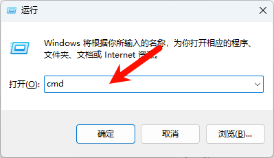
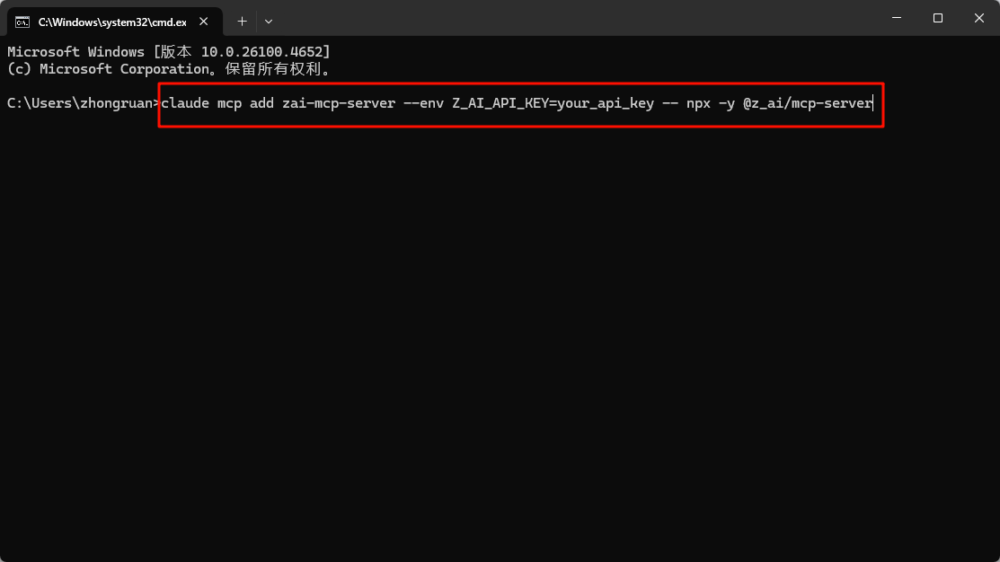
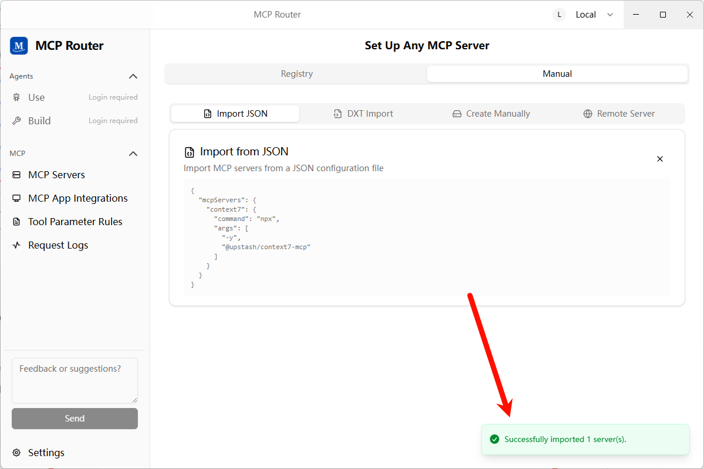
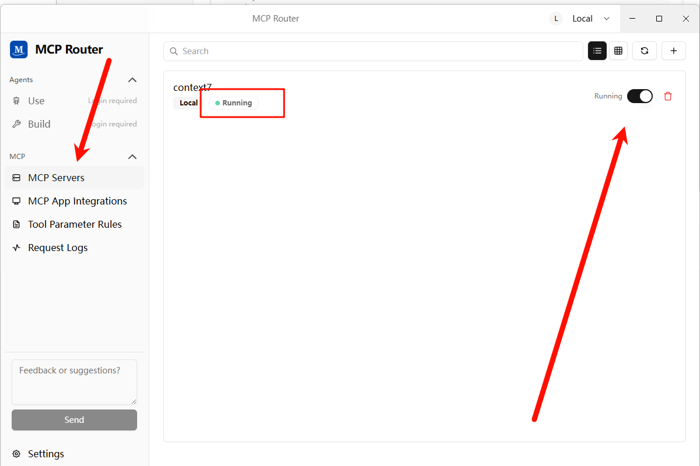

# Vibe Coding - 基础配置部分

## 基础配置

### Claude Code

> 官网直达：[Claude Code 设置 - Anthropic](https://docs.anthropic.com/zh-CN/docs/claude-code/settings#环境变量)

#### 国内CC平替-智谱

前往[点击注册](https://www.bigmodel.cn/claude-code?cc=fission_glmcode_sub_v1&ic=J2QPQGUXXQ&n=199****3721)购买包月套餐，推荐lite的包月20块一档的，如果有长期但量不多的需求可以买包年的

> [!NOTE]
>
> 据悉：走上面链接注册除了首月半价，还能叠加9折！
>
> 注意：只有pro以上的用户配有图像识别和联网搜索
>
> 推荐理由：不做类似openwebui这种大项目，够用了，还便宜量大


##### 智谱环境变量配置

> 截止到2025-09-19的推荐配置

| 变量名                        | 设置内容                               |
| ----------------------------- | -------------------------------------- |
| ANTHROPIC_AUTH_TOKEN          | API密钥                                |
| ANTHROPIC_BASE_URL            | https://open.bigmodel.cn/api/anthropic |
| ANTHROPIC_MODEL               | glm-4.5                                |
| ANTHROPIC_DEFAULT_HAIKU_MODEL | glm-4.5-air                            |

##### 视觉MCP配置

`win`键+`r`键，输入`cmd`，回车，输入`claude mcp add zai-mcp-server --env Z_AI_API_KEY=这里改成你的KEY -- npx -y @z_ai/mcp-server`





##### 智谱联网MCP配置

`win`键+`r`键，输入`cmd`，回车，输入`claude mcp add -s user -t http web-search-prime https://open.bigmodel.cn/api/mcp/web_search_prime/mcp --header "Authorization: Bearer 这里输入你的密钥"`


#### 环境变量

| 变量名                        | 设置内容                                       |
| ----------------------------- | ---------------------------------------------- |
| ANTHROPIC_AUTH_TOKEN          | 【使用第三方API必填】API密钥                   |
| ANTHROPIC_BASE_URL            | 【使用第三方API必填】API地址                   |
| ANTHROPIC_MODEL               | 默认模型                                       |
| ANTHROPIC_DEFAULT_HAIKU_MODEL | 后台小任务模型                                 |
| BASH_DEFAULT_TIMEOUT_MS       | bash 命令的默认超时                            |
| BASH_MAX_TIMEOUT_MS           | 模型可以为长时间运行的 bash 命令设置的最大超时 |
| BASH_MAX_OUTPUT_LENGTH        | bash 输出在中间截断之前的最大字符数            |
| CLAUDE_CODE_MAX_OUTPUT_TOKENS | 为大多数请求设置最大输出令牌数                 |
| MCP_TIMEOUT                   | MCP 服务器启动的超时时间（以毫秒为单位）       |
| MCP_TOOL_TIMEOUT              | MCP 工具执行的超时时间（以毫秒为单位）         |

#### 用量查看

##### 安装

```
npx ccusage@latest
```

##### 使用方法

```cmd
# 查看每日报告
ccusage 
ccusage daily

# 查看每周报告
ccusage weekly

# 查看每月报告
ccusage monthly

# 查看不同会话的报告
ccusage session

# 按每 5 小时计费窗口进行查看
ccusage blocks

# 实时监控
ccusage blocks --live
```

##### 添加到 Claude Code 的状态栏

打开`~/.claude/settings.json`，添加

~~~json
{
    "statusLine": {
        "type": "command",
        "command": "npx ccusage statusline"
    }
}
~~~

##### 中转api配置

方法一（推荐）：通过文件设置
编辑文件 ~/.claude/settings.json 文件添加以下内容(如果没有settings.json文件，请自行创建，不需要时可随意删除，不影响claude使用)：

windows下路径为: C:/Users/你的用户名/.claude

Linux 或 macOS 系统中通常位于: ∼/.claude

```
{
  "env": {
    "ANTHROPIC_AUTH_TOKEN": "你的API密钥",
    "ANTHROPIC_BASE_URL": "https://www.xxx.com",
    "CLAUDE_CODE_DISABLE_NONESSENTIAL_TRAFFIC": "1"
  },
  "permissions": {
    "allow": [],
    "deny": []
  }
}
```
方法二：通过环境变量设置
为了让 Claude Code 连接到你的中转服务，需要设置两个环境变量：

PowerShell 临时设置（当前会话）

在 PowerShell 中运行以下命令：


$env:ANTHROPIC_BASE_URL = "https://www.xxx.com"
$env:ANTHROPIC_AUTH_TOKEN = "你的API密钥"
NOTE

记得将 "你的API密钥" 替换为在上方 "API Keys" 标签页中创建的实际密钥。

PowerShell 永久设置（用户级）

在 PowerShell 中运行以下命令设置用户级环境变量：


# 设置用户级环境变量（永久生效）
[System.Environment]::SetEnvironmentVariable("ANTHROPIC_BASE_URL", "https://www.xxx.com", [System.EnvironmentVariableTarget]::User)
[System.Environment]::SetEnvironmentVariable("ANTHROPIC_AUTH_TOKEN", "你的API密钥", [System.EnvironmentVariableTarget]::User)
查看已设置的环境变量：


# 查看用户级环境变量
[System.Environment]::GetEnvironmentVariable("ANTHROPIC_BASE_URL", [System.EnvironmentVariableTarget]::User)
[System.Environment]::GetEnvironmentVariable("ANTHROPIC_AUTH_TOKEN", [System.EnvironmentVariableTarget]::User)
设置后需要重新打开 PowerShell 窗口才能生效。

验证环境变量设置

设置完环境变量后，可以通过以下命令验证是否设置成功：

在 PowerShell 中验证：


echo $env:ANTHROPIC_BASE_URL
echo $env:ANTHROPIC_AUTH_TOKEN
在 CMD 中验证：


echo %ANTHROPIC_BASE_URL%
echo %ANTHROPIC_AUTH_TOKEN%
预期输出示例：


https://www.xxx.com
xxxxxxxxxxxxxxxxxx
如果输出为空或显示变量名本身，说明环境变量设置失败，请重新设置。

PS：还有一些开源项目可以方便一键配置，请见文章下面（一些cc/codex配置开源项目推荐)


### CodeX

> 也可以看一下这篇帖子：[点击访问原帖](https://linux.do/t/topic/980364)

#### 配置文件

文件目录`~/.codex/config.toml`

~~~json
"OPENAI_API_KEY": "你的第三方api_key"
~~~

文件目录`~/.codex/config.toml`

 ```toml
 model = "gpt-5-codex" # Codex 0.36.0 支持
 model_reasoning_effort = "high" # 使用最大推理能力
 model_reasoning_summary = "detailed" # 在终端显示详细的推理总结（ctrl+T查看）OpenAI 没有推理过程，只有推理总结
 model_verbosity = "high" # 不懂，总之要拉满
 model_supports_reasoning_summaries = true # 强制启用推理总结，针对于自定义 API KEY 的
 
 [model_providers.供应商名称]
 name = "供应商名称"
 base_url = "基础URL，注意带后缀，可能是V1也可能是其他的，遵循gong'ying'h's"
 wire_api = "responses或者chat，视供应商情况填写，优先responses"
 requires_openai_auth = true
 
 hide_agent_reasoning = false # 允许显示更多的 AGENT 内部思考过程
 
 disable_response_storage = true # 不允许 OpenAI 服务端存储你的对话
 
 approval_policy = "never" # 配了但没用，总之先放着，建议通过 /approvals 配置
 sandbox_mode = "workspace-write" # 配了但没用，总之先放着，建议通过 /approvals 配置
 # allow network in workspace-write mode
 [sandbox_workspace_write]
 network_access = true
 
 # 下面为MCP的例子，超时可以设置startup_timeout_ms = 60000
 [mcp_servers.MCP名称]
 command = "方式"
 args = ["参数"]
 ```

#### 通过开源项目配置MCP

[点击访问GitHub](https://github.com/mcp-router/mcp-router)

1. 下载后打开 MCP Servers，通过不同的方式添加 MCP 服务

   

   

   

2. 添加成功提示

   

3. 添加 MCP 服务完成后，需要点击开启按钮，这个同时也会测试服务是否能正常使用

   

4. 添加 MCP App，因为 MCP Router 没有集成 codex，需要添加自定义应用并使用它的 token

   

5. 安装 mcpr-cli 服务，因为使用的是 mcpr-cli 服务的 connect 操作，需要额外安装一个 mcp

   `npm install -g mcpr-cli@latest`

6. 配置 mcp-router 到 Codex

   

   

7. 在 `config.toml` 中配置添加如下：

   ~~~toml
   # 只需要配置单个的 mcp-router 服务即可
   [mcp_servers.mcp-router]
   command = "npx" 
   args = ["-y", "mcpr-cli@latest", "connect"]
   env = { MCPR_TOKEN = "mcpr_iF8iNeMZft1Zv-iYF2ur50L5W4xXUMuX" }
   ~~~

8. 再测试 mcp 服务可用性，同样适用 mcp-server-time 测试

   

9.关于配置mcpr到claudecode：可以和mcpr中自定义的codex应用使用同一个应用（mcpr token），使用如下命令格式在终端导入：claude mcp add mcp-router --env MCPR_TOKEN=mcpr_xxxxxxxx -- npx -y mcpr-cli@latest connect
（前提是已经按照前面的配置过了，如没有配置过codex，可以仿照上述教程连接claude code,不需要第7步，直接输入上面的命令即可。

#### AGENTS.md

在实际操作过程中，发现只声明可用工具而不引导具体用法，经常会偏离预期，因此建议复制如下完整的配置，按需调整。

~~~
## Tool Priority

- Filename search: `fd`.
- Text/content search: `rg` (ripgrep).
- AST/structural search: `sg` (ast-grep) — preferred for code-aware queries (imports, call expressions, JSX/TSX nodes).

### AST-grep Usage (Windows)

- Announce intent and show the exact command before running complex patterns.
- Common queries:
  - Find imports from `node:path` (TypeScript/TSX):
    - `ast-grep -p "import $$ from 'node:path'" src --lang ts,tsx,mts,cts`
  - Find CommonJS requires of `node:path`:
    - `ast-grep -p "require('node:path')" src --lang js,cjs,mjs,ts,tsx`
  - Suggest rewrite (do not auto-apply in code unless approved):
    - Search: `ast-grep -p "import $$ from 'node:path'" src --lang ts,tsx`
    - Proposed replacement: `import $$ from 'pathe'`

### Search Hygiene (fd/rg/sg)

- Exclude bulky folders to keep searches fast and relevant: `.git`, `node_modules`, `coverage`, `out`, `dist`.
- Prefer running searches against a scoped path (e.g., `src`) to implicitly avoid vendor and VCS directories.
- Examples:
  - `rg -n "pattern" -g "!{.git,node_modules,coverage,out,dist}" src`
  - `fd --hidden --exclude .git --exclude node_modules --exclude coverage --exclude out --exclude dist --type f ".tsx?$" src`
- ast-grep typically respects `.gitignore`; target `src` to avoid scanning vendor folders:
  - `ast-grep -p "import $$ from '@shared/$$'" src --lang ts,tsx,mts,cts`
  - If needed, add ignore patterns to your ignore files rather than disabling ignores.
~~~

#### 系统通知

Codex 支持在任务执行完成后执行自定义事件，我们可以利用这一特性实现 Windows 系统弹窗通知。

Codex 文档见 https://github.com/openai/codex/blob/main/docs/config.md#notify

- ~/.codex/config.toml

```toml
notify = ["powershell.exe","-NoProfile","-ExecutionPolicy","Bypass","-File","C:\\Users\\<username>\\.codex\\notify.ps1"]
```

- ~/.codex/notify.ps1

```powershell
param(
  [Parameter(Mandatory = $true)]
  [string]$json
)

# 解析 JSON（Codex 把一段 JSON 作为 argv[1] 传进来）
try {
  $payload = $json | ConvertFrom-Json
} catch {
  $payload = @{}
}

$title = 'Codex'
$msg   = $payload.'last-assistant-message'
if (-not $msg) {
  if ($payload.type) {
    $msg = "Event: $($payload.type)"
  } else {
    $msg = 'Codex has an update.'
  }
}

# 可选：截断过长文本，注意只用 ASCII 的三点号，避免乱码
if ($msg -and $msg.Length -gt 240) {
  $msg = $msg.Substring(0,240) + '...'
}

# 只用 Toast，不要任何 Popup 兜底
Import-Module BurntToast -ErrorAction Stop
New-BurntToastNotification -Text $title, $msg | Out-Null
```

### Gemini Cli

#### 环境变量

```
变量名： GOOGLE_GEMINI_BASE_URL
变量值： https://API地址
变量名： GEMINI_API_KEY
变量值： sk-xxxxxxxxxxxxxxxxxxxxxxxxxxxxxxxxxxxxxxxx
```

## MCP推荐

### 1. Context7

[点击访问GitHub](https://github.com/upstash/context7)

查询技术规范


#### ClaudeCode

~~~
{
  "mcpServers": {
    "context7": {
      "command": "npx",
      "args": ["-y", "@upstash/context7-mcp"]
    }
  }
}
~~~

#### Codex

~~~toml
[mcp_servers.mcp-deepwiki]
command = "npx"
args = ["-y", "mcp-deepwiki@latest"]
~~~

### 2. Deepwiki

[点击前往GitHub](https://github.com/regenrek/deepwiki-mcp)

查询开源项目解析

~~~json
{
  "mcpServers": {
    "mcp-deepwiki": {
      "command": "npx",
      "args": ["-y", "mcp-deepwiki@latest"]
    }
  }
}
~~~


### 3. 互通各家AI-Cli

~~~json
    "codex": {
      "command": "cmd",
      "args": [
        "/c",
        "codex",
        "mcp"
      ]
    },
    "claude-code": {
      "command": "cmd",
      "args": [
        "/c",
        "claude",
        "mcp",
        "serve"
      ]
    },
    "gemini-cli": {
      "command": "cmd",
      "args": [
        "/c",
        "npx",
        "-y",
        "gemini-mcp-tool"
      ]
    },
~~~

### 4. Desktop Commander

[点击前往GitHub](https://github.com/wonderwhy-er/DesktopCommanderMCP?tab=readme-ov-file#option-4-add-to-claude_desktop_config-manually--auto-updates-requires-nodejs)

【AI总结生成：】提供本地终端控制、文件系统访问、代码编辑和自动化能力。它可执行命令、搜索文件、分析数据、编辑文本，并与本地进程交互，打造统一的开发操作入口。

~~~json
{
  "mcpServers": {
    "desktop-commander": {
      "command": "npx",
      "args": [
        "-y",
        "@wonderwhy-er/desktop-commander@latest"
      ]
    }
  }
}
~~~

### 5. Sequential Thinking

[点击前往GitHub](https://github.com/modelcontextprotocol/servers/tree/main/src/sequentialthinking#usage-with-claude-desktop)

【AI总结生成：】用于结构化思维过程，支持分步推理、分支探索与动态修正，适合解决复杂问题或需要保持上下文的任务。

~~~json
{
  "mcpServers": {
    "sequential-thinking": {
      "command": "npx",
      "args": [
        "-y",
        "@modelcontextprotocol/server-sequential-thinking"
      ]
    }
  }
}
~~~

### 6.serena

[点击前往GitHub](https://github.com/oraios/serena?tab=readme-ov-file#using-uvx)

【AI总结生成：】提供语义级代码检索与编辑能力，支持多语言，通过符号级操作提升代码理解与修改效率，尤其适用于大型代码库。

#### ClaudeCode

在你的项目目录下，通过如下命令添加 Serena：

```bash
claude mcp add serena -- <serena-mcp-server> --context ide-assistant --project $(pwd)
```

其中 `<serena-mcp-server>` 是你运行 Serena MCP 服务端的方式。例如使用 `uvx` 时，命令如下：

```bash
claude mcp add serena -- uvx --from git+https://github.com/oraios/serena serena start-mcp-server --context ide-assistant --project $(pwd)
```

ℹ️ Serena 自带一份工具说明文本，Claude 需要读取它才能正确使用 Serena 的工具。从 v1.0.52 起，Claude Code 会自动读取 MCP 服务端的说明。如果你使用的是旧版本，或 Claude 未能成功读取说明，可以手动请求它“读取 Serena 的初始说明”，或运行 `initial_instructions` 工具来加载说明文本。若要启用该功能，请在配置中显式添加 `included_optional_tools`。

#### Codex

Codex 是全局添加 MCP 服务端，而非按项目添加。请将以下内容添加到 `~/.codex/config.toml`（如文件不存在请新建）：

```toml
[mcp_servers.serena]
command = "uvx"
args = ["--from", "git+https://github.com/oraios/serena", "serena", "start-mcp-server", "--context", "codex"]
```

启动 Codex 后，请激活项目：

```
Activate the current dir as project using serena
```

如果未激活项目，将无法使用 Serena 的工具！

你可以查看 `~/.codex/log/codex-tui.log` 来确认是否有错误发生。

Serena 的仪表盘默认会启动，但由于 Codex 的沙箱限制，浏览器可能不会自动打开。你可以手动访问：

```http
http://localhost:24282/dashboard/index.html
```

⚠️ Codex 有时会错误地显示工具执行失败，即使实际执行成功。这是已知问题，不影响使用。

### 7. Chrome-Devtools

~~~cmd

# Claude Code
claude mcp add chrome-devtools npx chrome-devtools-mcp@latest

# Codex
codex mcp add chrome-devtools -- npx chrome-devtools-mcp@latest

# Gemini CLI

# 编辑Gemini设置文件
   nano ~/.gemini/settings.json
   # 或者使用你喜欢的编辑器
   code ~/.gemini/settings.json

# 添加Chrome DevTools MCP配置：在 settings.json 文件中添加以下配置：

{
     "mcpServers": {
       "chrome-devtools": {
         "command": "npx",
         "args": ["chrome-devtools-mcp@latest"]
       }
     }
   }
   
   
 # 带参数的高级配置
 
 {
  "mcpServers": {
    "chrome-devtools": {
      "command": "npx",
      "args": [
        "chrome-devtools-mcp@latest",
        "--channel=canary",
        "--headless=true",
        "--isolated=true"
      ]
    }
  }
}

#验证配置，输入：Check the performance of https://developers.chrome.com

~~~
## 一些cc/codex配置开源项目推荐
### CC Switch
(强强强烈推荐!!!) : 使用CC SWITCH进行配置claude
使用cc switch 配置 查看 [cc switch](https://github.com/farion1231/cc-switch)
claude code在cc中编辑


```
{
  "env": {
    "ANTHROPIC_AUTH_TOKEN": "88_xxx",
    "ANTHROPIC_BASE_URL": "https://www.88code.org/api",
    "CLAUDE_CODE_DISABLE_NONESSENTIAL_TRAFFIC": "1"
  },
  "permissions": {
    "allow": [],
    "deny": []
  }
}
```
### ：88code-desktop
https://github.com/byebye-code/88code-desktop
使用这个工具可以一键配置第三方api至claudecode/codex，只需将里面的baseurl替换为自己的中转站url即可

