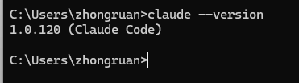
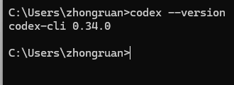

# Vibe Coding - 安装部分

## 安装

### 基础环境

####  Node.js 环境

- 打开浏览器访问 https://nodejs.org/
- 点击 "LTS" 版本进行下载（推荐长期支持版本）
- 下载完成后双击 .msi 文件
- 按照安装向导完成安装，保持默认设置即可

> [!TIP]
>
> - 建议使用 PowerShell 而不是 CMD
> - 如果遇到权限问题，尝试以管理员身份运行
> - 某些杀毒软件可能会误报，需要添加白名单


选择自己合适的版本，一路下一步。

安装完成后，打开CMD，输入以下命令验证安装：

```
node --version
npm --version
```

如果显示版本号，说明安装成功

#### Git Bash

> [!TIP]
>
> Windows 环境下需要使用 Git Bash 安装 Claude code。安装完成后，环境变量设置和使用 Claude Code 仍然在普通的 PowerShell 或 CMD 中进行。

下载并安装 Git for Windows

- 访问 https://git-scm.com/downloads/win
- 点击 "Download for Windows" 下载安装包
- 运行下载的 .exe 安装文件
- 在安装过程中保持默认设置，直接点击 "Next" 完成安装


安装完成后，打开 Git Bash，输入以下命令验证：

```
git --version
```

如果显示版本号，说明安装成功


### Claude Code

打开 Git Bash（重要：不要使用 PowerShell），运行以下命令：

```
npm install -g @anthropic-ai/claude-code
```

安装完成后，输入以下命令检查是否安装成功：

```
claude --version
```

如果显示版本号，恭喜你！Claude Code 已经成功安装了。



### Claude Code for VS Code

打开VS CODE插件市场，搜索`Claude Code for VS Code`，或者[点击访问](https://marketplace.visualstudio.com/items?itemName=anthropic.claude-code)


安装完成后，摁住`cmd+shift+p` 输入claude搜索，选择 `open in side bar`


然后编辑（或者新增）`~/.claude/config.json`

~~~json
{
  "primaryApiKey": "default"
}
~~~

**修改配置后重启！！！**

### Codex CLI

打开 Git Bash（重要：不要使用 PowerShell），运行以下命令：

```
npm install -g @openai/codex
```

这个命令会从 npm 官方仓库下载并安装最新版本的 Codex CLI。

安装完成后，输入以下命令检查是否安装成功：

```
codex --version
```

如果显示版本号，恭喜你！Codex CLI 已经成功安装了。



### Gemini CLI


打开 Git Bash（重要：不要使用 PowerShell），运行以下命令：

```
npm install -g @google/gemini-cli
```

这个命令会从 npm 官方仓库下载并安装最新版本的 Gemini CLI。

安装完成后，输入以下命令检查是否安装成功：

```
gemini --version
```

如果显示版本号，恭喜你！Gemini CLI 已经成功安装了。

### Cursor

#### 项目介绍

>  Cursor is a fork of VS Code. This allows us focus on making the best way to code with AI, while offering a familiar text editing experience.

Cursor 是 VS Code 的一个分支，这让我们能够专注于利用 AI 提升编码体验，同时提供熟悉的文本编辑界面。

1. 官方主页：https://www.cursor.com/
2. 下载地址：[主页下载](https://www.cursor.com/)
3. 使用指南：https://docs.cursor.com/