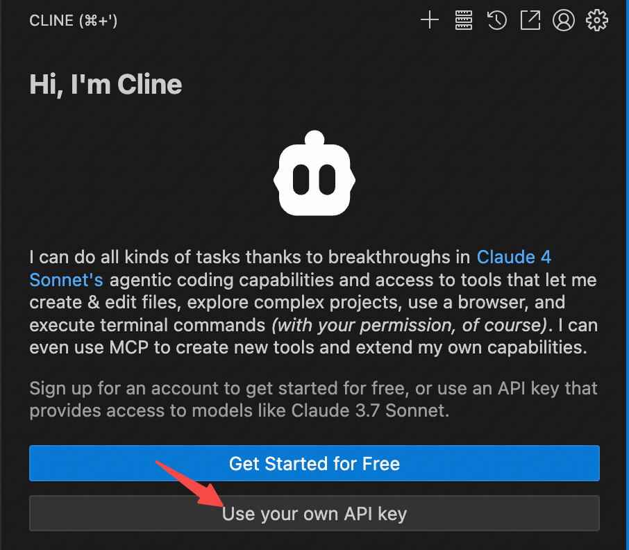
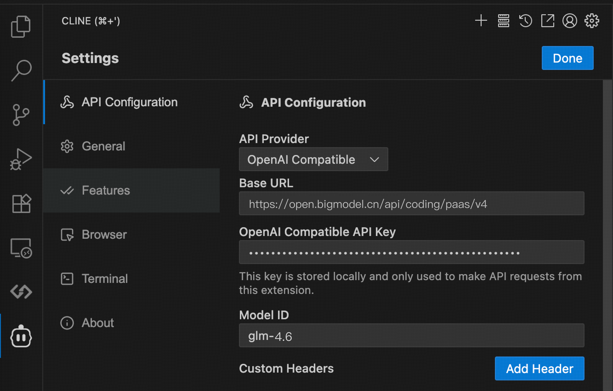

# 推广

## 智谱

前往[点击注册](https://www.bigmodel.cn/claude-code?cc=fission_glmcode_sub_v1&ic=J2QPQGUXXQ&n=199****3721)购买包月套餐，推荐lite的包月20块一档的，如果有长期但量不多的需求可以买包年的

> [!NOTE]
>
> 据悉：走上面链接注册除了首月半价，还能叠加9折！
>
> 注意：只有pro以上的用户配有图像识别和联网搜索

### ClaudeCode配置

#### 智谱环境变量配置

> 截止到2025-09-19的推荐配置

| 变量名                        | 设置内容                               |
| ----------------------------- | -------------------------------------- |
| ANTHROPIC_AUTH_TOKEN          | API密钥                                |
| ANTHROPIC_BASE_URL            | https://open.bigmodel.cn/api/anthropic |
| ANTHROPIC_MODEL               | glm-4.6                                |
| ANTHROPIC_DEFAULT_HAIKU_MODEL | glm-4.5-air                            |

#### 视觉MCP配置

`win`键+`r`键，输入`cmd`，回车，输入`claude mcp add zai-mcp-server --env Z_AI_API_KEY=这里改成你的KEY -- npx -y @z_ai/mcp-server`

#### 智谱联网MCP配置

`win`键+`r`键，输入`cmd`，回车，输入`claude mcp add -s user -t http web-search-prime https://open.bigmodel.cn/api/mcp/web_search_prime/mcp --header "Authorization: Bearer 这里输入你的密钥"`

### Cline类软件

#### 1. 选择 API Key 方式

选择 `Use your own API Key`

#### 2. 填入配置信息

请按照以下配置填入相关信息：

- **API Provider**：选择 `OpenAI Compatible`
- **Base URL**：输入 `https://open.bigmodel.cn/api/coding/paas/v4`
- **API Key**：填入您的智谱 API Key
- **模型**：选择”使用自定义”，并输入模型名称（如：`glm-4.6`）
- **其他配置**：根据您的任务需求调整，例如 temperature 设置、取消勾选 browser use 等

